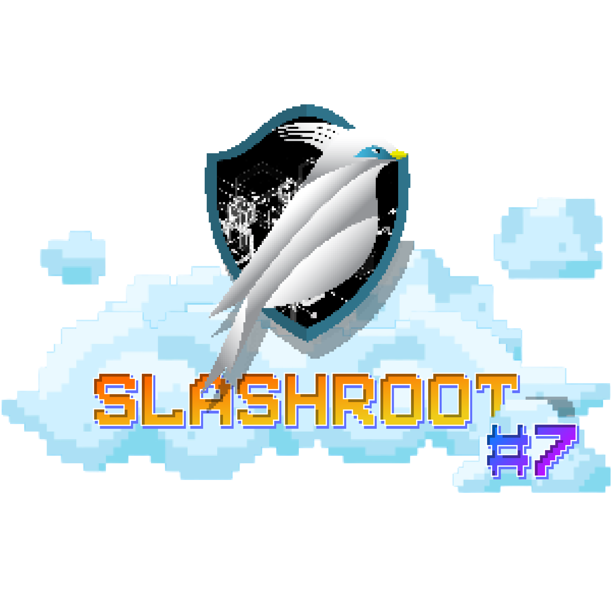
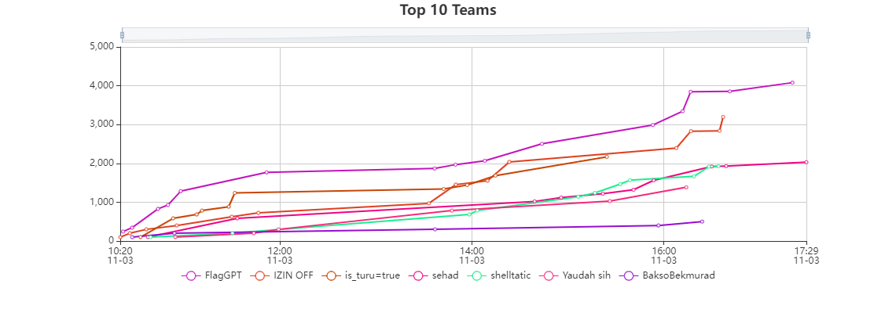
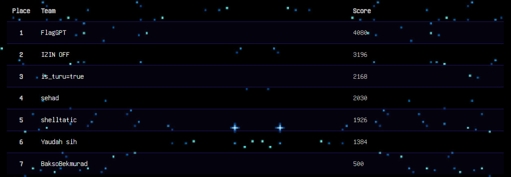

#  SlashRoot 7 2023 (Jeopardy) - Problemset

SlashRoot is an annual national cyber security competition in Indonesia organized by the Linux Study Group Student Activity Unit, Institute of Technology and Business STIKOM Bali.

This repository contains the problemset for SlashRoot 7 2023.

## List of Problems Qualifier

| Name                                                                                                                                     | Category | Problem Setter                                   |
| ---------------------------------------------------------------------------------------------------------------------------------------- | -------- | ------------------------------------------------ |
| [`Booklist Library`](https://github.com/Kelompok-Studi-Linux-Stikom-Bali/soal-slashroot-7/tree/master/penyisihan/web/booklist-libary)    | Web      | [Ananta](https://github.com/AnantaWeda)          |
| [`Give Me Feedback`](https://github.com/Kelompok-Studi-Linux-Stikom-Bali/soal-slashroot-7/tree/master/penyisihan/web/give-me-feedback)   | Web      | [Ananta](https://github.com/AnantaWeda)          |
| [`Verylight`](https://github.com/Kelompok-Studi-Linux-Stikom-Bali/soal-slashroot-7/tree/master/penyisihan/web/verylight)                 | Web      | [Ibnu](https://github.com/ibnudz)                |
| [`LotFeTT`](https://github.com/Kelompok-Studi-Linux-Stikom-Bali/soal-slashroot-7/tree/master/penyisihan/web/lotfett)                     | Web      | [Ibnu](https://github.com/ibnudz)                |
| [`Asem`](https://github.com/Kelompok-Studi-Linux-Stikom-Bali/soal-slashroot-7/tree/master/penyisihan/reverse/asem)                       | Reverse  | [Indra Yana](https://github.com/indrayyana)      |
| [`Sanca`](https://github.com/Kelompok-Studi-Linux-Stikom-Bali/soal-slashroot-7/tree/master/penyisihan/reverse/sanca)                     | Reverse  | [Indra Yana](https://github.com/indrayyana)      |
| [`Lazy`](https://github.com/Kelompok-Studi-Linux-Stikom-Bali/soal-slashroot-7/tree/master/penyisihan/reverse/lazy)                       | Reverse  | [Indra Yana](https://github.com/indrayyana)      |
| [`Dragon's Lair`](https://github.com/Kelompok-Studi-Linux-Stikom-Bali/soal-slashroot-7/tree/master/penyisihan/reverse/dragons_lair)      | Reverse  | [Indra Yana](https://github.com/indrayyana)      |
| [`Zebra Cross`](https://github.com/Kelompok-Studi-Linux-Stikom-Bali/soal-slashroot-7/tree/master/penyisihan/forensics/zebra_cross)       | Forensic | [Krisna](https://github.com/wiranatakrisna)      |
| [`Bad Radio`](https://github.com/Kelompok-Studi-Linux-Stikom-Bali/soal-slashroot-7/tree/master/penyisihan/forensics/bad-radio)           | Forensic | [Hari](https://github.com/gedehari)              |
| [`Video Hacker`](https://github.com/Kelompok-Studi-Linux-Stikom-Bali/soal-slashroot-7/tree/master/penyisihan/forensics/video_hacker)     | Forensic | [Ekajaya](https://github.com/ekajaya740)         |
| [`Check Your Ear`](https://github.com/Kelompok-Studi-Linux-Stikom-Bali/soal-slashroot-7/tree/master/penyisihan/forensics/check_your_ear) | Forensic | [Ibnu](https://github.com/ibnudz)                |
| [`Kode Rahasia`](https://github.com/Kelompok-Studi-Linux-Stikom-Bali/soal-slashroot-7/tree/master/penyisihan/OSINT/kode_rahasia)         | OSINT    | [Indra Yana](https://github.com/indrayyana)      |
| [`Waka Waka eh eh`](https://github.com/Kelompok-Studi-Linux-Stikom-Bali/soal-slashroot-7/tree/master/penyisihan/OSINT/waka_waka_eh_eh)   | OSINT    | [Indra Yana](https://github.com/indrayyana)      |
| [`Anabul`](https://github.com/Kelompok-Studi-Linux-Stikom-Bali/soal-slashroot-7/tree/master/penyisihan/OSINT/anabul)                     | OSINT    | [Wrinda](https://github.com/WrindaWaneswari)     |
| [`Vacation`](https://github.com/Kelompok-Studi-Linux-Stikom-Bali/soal-slashroot-7/tree/master/penyisihan/OSINT/Vacation)                 | OSINT    | [Wrinda](https://github.com/WrindaWaneswari)     |
| [`Nostalgia Child`](https://github.com/Kelompok-Studi-Linux-Stikom-Bali/soal-slashroot-7/tree/master/penyisihan/OSINT/nostalgia_child)   | OSINT    | [Riyan](https://github.com/riyanpradana21)       |
| [`eeee`](https://github.com/Kelompok-Studi-Linux-Stikom-Bali/soal-slashroot-7/tree/master/penyisihan/crypto/eeee)                        | Crypto   | [MockingJay](https://github.com/MockingjayIndra) |
| [`Summary`](https://github.com/Kelompok-Studi-Linux-Stikom-Bali/soal-slashroot-7/tree/master/penyisihan/crypto/summary)                  | Crypto   | [MockingJay](https://github.com/MockingjayIndra) |
| [`X1rt4m`](https://github.com/Kelompok-Studi-Linux-Stikom-Bali/soal-slashroot-7/tree/master/penyisihan/crypto/x1rt4m)                    | Crypto   | [MockingJay](https://github.com/MockingjayIndra) |
| [`aestethic`](https://github.com/Kelompok-Studi-Linux-Stikom-Bali/soal-slashroot-7/tree/master/penyisihan/crypto/aestethic)              | Crypto   | [MockingJay](https://github.com/MockingjayIndra) |
| [`sandbox`](https://github.com/Kelompok-Studi-Linux-Stikom-Bali/soal-slashroot-7/tree/master/penyisihan/pwn/sandbox)                     | PWN      | [Ibnu](https://github.com/ibnudz)                |
| [`saved`](https://github.com/Kelompok-Studi-Linux-Stikom-Bali/soal-slashroot-7/tree/master/penyisihan/pwn/saved)                         | PWN      | [Ibnu](https://github.com/ibnudz)                |
| [`sender`](https://github.com/Kelompok-Studi-Linux-Stikom-Bali/soal-slashroot-7/tree/master/penyisihan/pwn/sender)                       | PWN      | [Ibnu](https://github.com/ibnudz)                |
| [`sheep`](https://github.com/Kelompok-Studi-Linux-Stikom-Bali/soal-slashroot-7/tree/master/penyisihan/pwn/sheep)                         | PWN      | [Ibnu](https://github.com/ibnudz)                |
| [`Galaxy Ikan Bilis`](https://github.com/Kelompok-Studi-Linux-Stikom-Bali/soal-slashroot-7/tree/master/penyisihan/JOY/Galaxy-Ikan-Bilis) | Joy      | [Ekajaya](https://github.com/ekajaya740)         |

## Points Recap Qualifier

| [Points Recap Qualifier Download](assets/files/Rekap_Point_Slashroot_CTF_Quals.xlsx) |
| ------------------------------------------------------------------------------------ |

## Final Scoreboard

## List of Problems Final

| Name                                                                                                                    | Category       | Problem Setter                              |
| ----------------------------------------------------------------------------------------------------------------------- | -------------- | ------------------------------------------- |
| [`Cryver`](https://github.com/Kelompok-Studi-Linux-Stikom-Bali/soal-slashroot-7/tree/master/final/reverse/cryver) | Reverse        | [Indra Yana](https://github.com/indrayyana) |
| [`Slash Card`](https://github.com/Kelompok-Studi-Linux-Stikom-Bali/soal-slashroot-7/tree/master/final/reverse/slash_card) | Reverse        | [Indra Yana](https://github.com/indrayyana) |
| [`Dragon's Lair 2`](https://github.com/Kelompok-Studi-Linux-Stikom-Bali/soal-slashroot-7/tree/master/final/reverse/dragons_lair2) | Reverse        | [Indra Yana](https://github.com/indrayyana) |
| [`GG Gaming`](https://github.com/Kelompok-Studi-Linux-Stikom-Bali/soal-slashroot-7/tree/master/final/OSINT/gg_gaming) | OSINT        | [Indra Yana](https://github.com/indrayyana) |
| [`Belajar Pemrograman`](https://github.com/Kelompok-Studi-Linux-Stikom-Bali/soal-slashroot-7/tree/master/final/OSINT/belajar_pemrograman) | OSINT        | [Krisna](https://github.com/wiranatakrisna) |
| [`JONES and The Unknown Treasure`](https://github.com/Kelompok-Studi-Linux-Stikom-Bali/soal-slashroot-7/tree/master/final/OSINT/JONES_and_The_Unknown_Treasure) | OSINT        | [Wrinda](https://github.com/WrindaWaneswari) |
| [`Johan Weissmann Tower Defense`](https://github.com/Kelompok-Studi-Linux-Stikom-Bali/soal-slashroot-7/tree/master/final/Joy/Johan-Weissmann-Tower-Defense)         | JOY | [Ekajaya](https://github.com/ekajaya740)|
| [`Calculator`](https://github.com/Kelompok-Studi-Linux-Stikom-Bali/soal-slashroot-7/tree/master/final/web/calculator) | Web | [AnantaWeda](https://github.com/anantaweda)|
| [`Login For Admin`](https://github.com/Kelompok-Studi-Linux-Stikom-Bali/soal-slashroot-7/tree/master/final/web/login_for_admin) | Web | [AnantaWeda](https://github.com/anantaweda)|
| [`complain`](https://github.com/Kelompok-Studi-Linux-Stikom-Bali/soal-slashroot-7/tree/master/final/web/complain) | Web | [Ganes](https://github.com/Ganes556)|
| [`baru belajar ngab`](https://github.com/Kelompok-Studi-Linux-Stikom-Bali/soal-slashroot-7/tree/master/final/pwn/baru-belajar-ngab) | PWN | [Ekajaya](https://github.com/ekajaya740)|
| [`shelly`](https://github.com/Kelompok-Studi-Linux-Stikom-Bali/soal-slashroot-7/tree/master/final/pwn/shelly) | PWN | [MockingJay](https://github.com/MockingjayIndra)|
| [`Short`](https://github.com/Kelompok-Studi-Linux-Stikom-Bali/soal-slashroot-7/tree/master/final/pwn/short) | PWN | [Ibnu](https://github.com/ibnudz)|
| [`ez guess`](https://github.com/Kelompok-Studi-Linux-Stikom-Bali/soal-slashroot-7/tree/master/final/crypto/ezGuess) | Crypto   | [Anehman](https://github.com/anehman) |
| [`asdce`](https://github.com/Kelompok-Studi-Linux-Stikom-Bali/soal-slashroot-7/tree/master/final/crypto/asdce) | Crypto   | [MockingJay](https://github.com/MockingjayIndra) |
| [`JackD`](https://github.com/Kelompok-Studi-Linux-Stikom-Bali/soal-slashroot-7/tree/master/final/crypto/JackD) | Crypto   | [MockingJay](https://github.com/MockingjayIndra) |
| [`QAES`](https://github.com/Kelompok-Studi-Linux-Stikom-Bali/soal-slashroot-7/tree/master/final/crypto/?) | Crypto   | [Anehman](https://github.com/anehman) |
| [`Coming Soon`](https://github.com/Kelompok-Studi-Linux-Stikom-Bali/soal-slashroot-7/tree/master/final/forensic/?) | Forensic | [Ibnu](https://github.com/ibnudz) |
| [`Coming Soon`](https://github.com/Kelompok-Studi-Linux-Stikom-Bali/soal-slashroot-7/tree/master/final/forensic/?) | Forensic | [Hari](https://github.com/gedehari) |

## Points Recap Final

| [Points Recap Final Download](assets/files/Rekap_Point_Slashroot_CTF_Final.xlsx) |
| -------------------------------------------------------------------------------- |